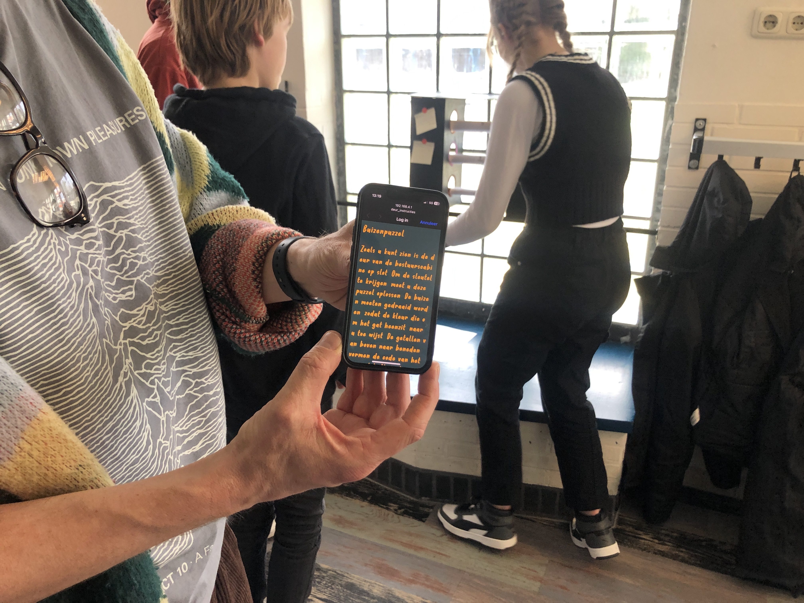

# Solarpunk Escaperoom

This is a variation on the solarpunk workshop where we made an escape room. The theme drifted from SolarPunk a bit, the partcipants chose their own theme (escaping from an submarine that was running out of oxygen). In future versions it would be great to facilitate storytelling about solarpunk futures instead. Here you find the documentation of the one-week workshop we did in 2023 with 15 year old high-schoolers (materials in Dutch, sowwy)

## Introduction

Is all the internet global? Can I create my own internet? How much power does it consume? Is it bad for the environment? At
Hackers & Designers we conduct experiments to find out what a sustainable internet of the future could look like. Do you want
join us? We're going to create portable Wi-Fi networks to hide digital clues somewhere in school. After making the
game, of course we go hunting and try to find the clues with our mobile phones!

Participants learned how to design a game and create light mini websites using HTML and CSS. These websites are hosted on mobile, solar powered Wi-Fi modules that host the websites, but only within a 20m range from the module. Together, we write a scenario with different "scenes" or obstacles. In groups of 2-3 participants made puzzles with a physical as well as a digital component that players have to solve. At the end of the week we played the escape room with another group of pupils from the same year, and the participant's parents and teachers. 

## Related

The technical setup is described in the solar punk scavenger hunt workshops we did before, documented here: 

[https://github.com/hackersanddesigners/WifiZineThrowie_ScavengerHunt](https://github.com/hackersanddesigners/WifiZineThrowie_ScavengerHunt)

## Fileguide

In the files you can find the week's program outline, slides with exercises we did, example code, and some code participants made. Other than in the other Solarpunk workshops so far, the participants made slightly more complex websites that includes some scripting. This allowed them to ask users for input (e.g. a code) that they could verify before sending user to a next page. 

## Slides

The program had two blocks of technical instruction, marked pink in the program below. In the first block talked a bit about Solarpunk and our relationship to the internet and our scrolling behaviour. We did a little exercise guessing how much we scroll per year on average. The answer was on a [https://github.com/hackersanddesigners/solarpunk_escaperoom/tree/main/files/data-scrolllll](little captive portal website created on an ESP module). After a bit of scrolling it is revealed that the actual answer is taped below one of the seats in the classroom...
Then we looked at the ESP32 module, possibilities, limitations and explained how the captive network page that the participants had just seen works. The slides for this part can be found [https://github.com/hackersanddesigners/Esp32-introductie](here) and be viewed [https://hackersanddesigners.github.io/Esp32-introductie/](online here).
The second part was all about HTML, what is it, how does it work. What is CSS and how can you use it. The students were challenged to make a simple mini website for themselves (Note for future iteration: have a clear assignment here.) The slides for this part can be found [https://github.com/hackersanddesigners/html-css-slides-introductie](here) and be viewed [https://hackersanddesigners.github.io/html-css-slides-introductie](online here).

## Impression

## Program

 *Amazing pixel art by one of the participants.*

